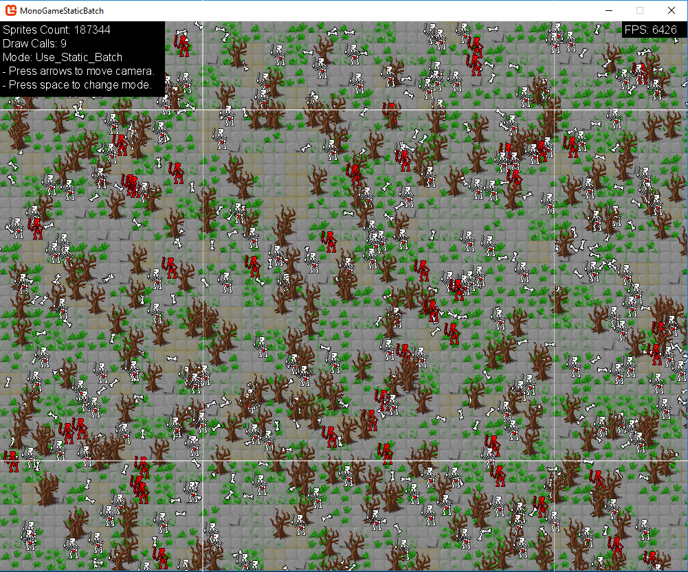

# MonoGame.StaticBatch

Helper class to batch together static sprites and boost performance


# What Is It

`MonoGame.StaticBatch` allow you to batch together multiple static sprites, to reduce significantly their drawing times (and drawing calls).
As an added bonus, it also add grid-based culling to skip sprites that are not currently visible in screen.

**A test scene showed improvement from 10-300 FPS* without static batch to 6000+ FPS with static batch.**

*10 FPS when drawing all scene, 300 when drawing only what's in screen.

## How It Works

The class will divide your scene into a grid of render targets, and will draw all your static sprites during the initialization (hence they need to be static).

When drawing the static batch, instead of drawing all the individual sprites (lots of draw calls!) it will only draw a small subset of the static textures grid.

The following screenshot illustrates a static batch with textures sized 512x512. There are also lots of sprites outside of screen, not rendered. As you can see with static batch we only need 9 draw calls!




## Advantages

When drawing lots of sprites, using the static batch boost performance significantly. More specifically, you enjoy the following benefits:

1. Much less draw calls.
2. Automatic grid-based culling of invisible pixels.
3. Zero work on hidden pixels (pixels covered by other sprites).

## Caveats

`MonoGame.StaticBatch` doesn't come without a price. 

1. Sprites should be static (updating is possible but less fun).
2. Takes up more memory (depending on how many textures you end up using).
3. Requires some build time, but usually unnoticeable if only done in init.


# How To Use

To use the static batch you need to add sprites to it, then build it (convert list of sprites into textures grid) and finally draw the batch.

For example:

```cs
// create the static batch with 512x512 textures
StaticBatch staticBatch = new StaticBatch(GraphicsDevice, new Point(512, 512));

// add some sprites to it
staticBatch.AddSprites(new StaticBatch.StaticSprite(texture, destRect, srcRect, ....));

// build the batch
staticBatch.Build(spriteBatch);

// draw the batch
staticBatch.Draw(spriteBatch);
```

## Culling

If your scene exceed the screen boundaries, you'll want to cull out invisible textures. To do so, provide a viewport param when drawing the batch:

```cs
var viewport = GraphicsDevice.Viewport.Bounds;
staticBatch.Draw(spriteBatch, viewport);
```

## Using Camera

To add a simple 2d camera you can use the viewport combined with offset:

```cs
var viewport = GraphicsDevice.Viewport.Bounds;
viewport.Location += cameraPos.ToPoint();
staticBatch.Draw(spriteBatch, viewport, offset: (-cameraPos).ToPoint());
```

For more complicated stuff you can just begin the spritebatch yourself, and provide whatever transformation matrix you'd want with it.

```cs
spriteBatch.Begin(...);
staticBatch.Draw(spriteBatch, viewport, beginAndEnd: false);
```

Just remember that if you want to use culling its your responsibility to match the viewport to the transformation matrix.

## Sampler, Blend and Sort

You can change the sampler state, blend state and Sort mode used when building and drawing the batch:

```cs
staticBatch.DefaultBlend = BlendState.AlphaBlend;
staticBatch.DefaultSamplerState = SamplerState.PointClamp;
staticBatch.DefaultSortMode = SpriteSortMode.BackToFront;
```

Be sure to set those values **before** building the static batch.

## Adding Sprites

To add sprites to an existing, already built batch, you can simple call AddSprite() and Build() again, but without the clear flag. This will append new sprites on existing textures:

```cs
staticBatch.AddSprites(new StaticBatch.StaticSprite(texture, destRect, srcRect, ....));
staticBatch.Build(spriteBatch, clear: false);
```

# Demo

To watch a live demo of the static batch, clone this repo and Build & Run the project as Window / Console application.

What you'll see is a scene with tilemap, lots of bones, skeletons, and trees. 
By default, the scene will be drawn using the static batch. However, you can switch between drawing methods and compare performance and FPS.

## Credits

Sprites used in demo are from the following sources:

- [https://opengameart.org/content/skeleton-warrior-1](https://opengameart.org/content/skeleton-warrior-1)
- [https://opengameart.org/content/32x32-tilemap-grass-dungeon-floors-snow-water](https://opengameart.org/content/32x32-tilemap-grass-dungeon-floors-snow-water)
- [https://opengameart.org/content/lpc-all-seasons-apple-tree](https://opengameart.org/content/lpc-all-seasons-apple-tree)


# License
